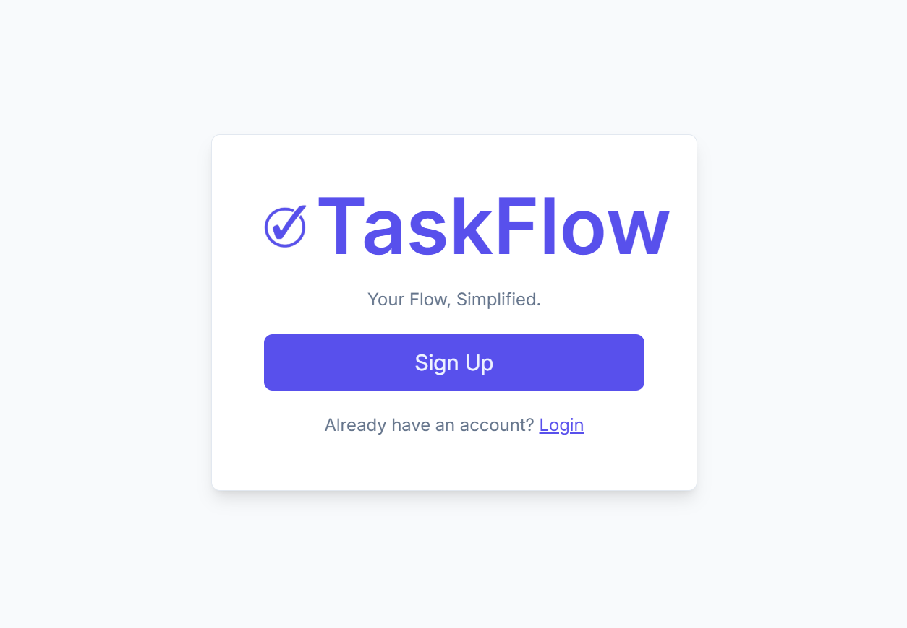
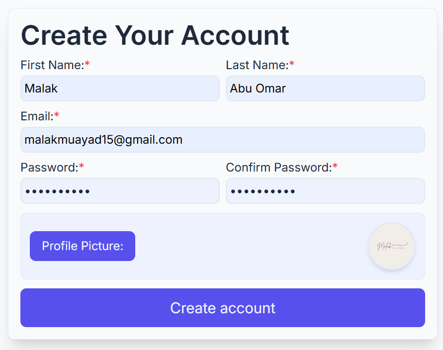
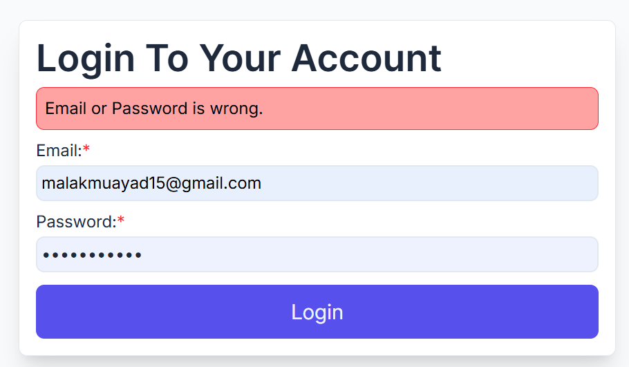
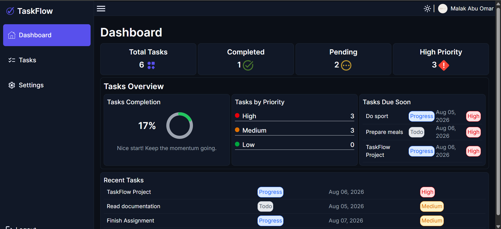
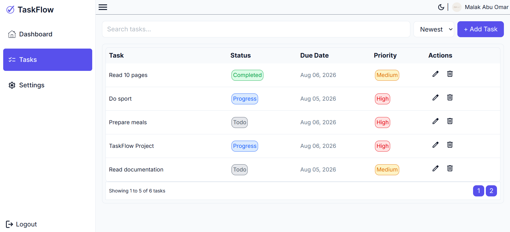
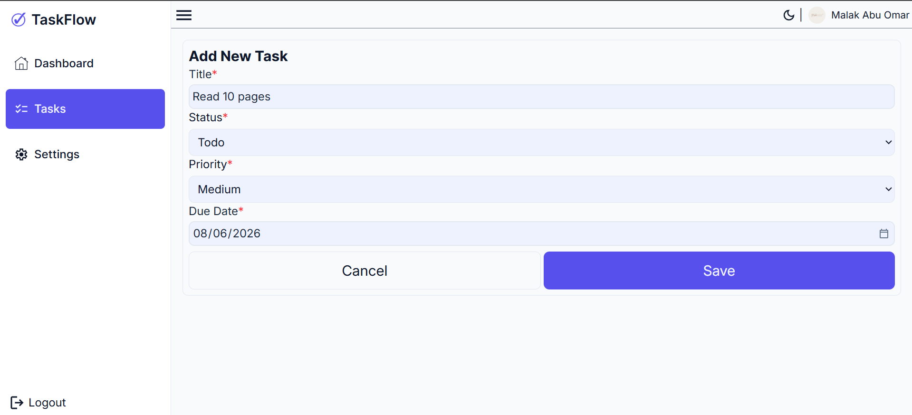
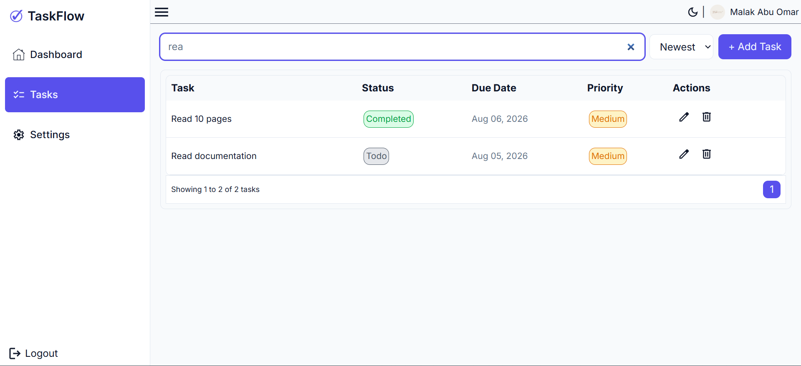
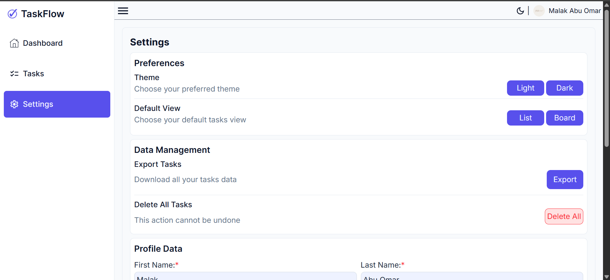
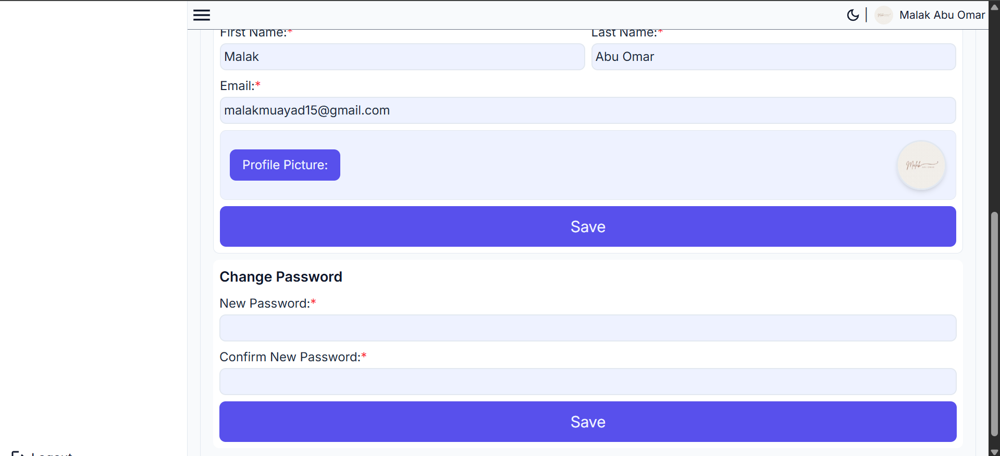

# ☑️ TaskFlow (React App)

A responsive task management front-end application that allows users to create, edit, delete, search, filter, and track their tasks with real-time statistics. Built using React, TypeScript, Tailwind CSS, and IndexedDB for client-side data persistence.

## ✅ Features

- ➕ Add, edit, and delete tasks.
- 📝 Manage task details including title, description, priority, status, and due date.
- 🔍 Search tasks by title.
- 🎯 Filter tasks by status and priority.
- 📊 Display task statistics and completion progress.
- ⏰ Highlight upcoming tasks and tasks due soon.
- 📄 Paginated task listing for better performance.
- 📋 List and board tasks view.
- 📂 Export tasks into a PDF file.
- 👤 User registration and login system.
- 🔐 Store user data securely using IndexedDB.
- 🌙 Support light and dark themes.
- 📱 Fully responsive design for desktop, tablet, and mobile screens.

## ⚙️ Technologies

- HTML5
- CSS3
- Tailwind CSS (v4)
- JavaScript (ES6+)
- TypeScript
- React
- React Router
- Context API
- IndexedDB
- Cookies
- Local Storage
- Vite

## 🗄️ Data Storage

TaskFlow currently uses browser storage technologies:

- **IndexedDB** for storing user accounts and task data.
- **Local Storage** for storing application preferences.
- **Cookies** for storing logged-in user session.

> Note: This project is currently a frontend-only application. For a production environment, I would migrate data management to a backend API using ASP.NET Core, Entity Framework Core, and SQL Server to support authentication, scalability, and multi-device synchronization.

## 🚀 Deployment

The project is live and accessible here:

🔗 **Live Demo:**  
[TaskFlow](https://taskflow-one-ashy.vercel.app/)

### Deployment Platform

- Vercel

## 🚀 How to Run Locally

1. Clone the repository:

```bash
git clone https://github.com/malakmuayad11/TaskFlow.git
```

2. Navigate to the project folder:

```bash
cd TaskFlow
```

3. Install dependencies:

```bash
npm install
```

4. Start the development server:

```bash
npm run dev
```

5. Open the local URL shown in the terminal.

## 📸 Screenshots

### 📍 Start Page



### 🔐 Sign Up Page



### 🔓 Login Page



### 🏠 Dashboard



### 🏠 Tasks List Page



### ➕ Add Task



### 🔎 Search Task



### ⚙️ Settings Page




## 🎥 Demo

▶️ [Watch TaskFlow Demo](https://drive.google.com/file/d/1kMIbshwuzqmUWAczl0yQuqExv-CoAZiN/view?usp=sharing)

## 👩‍💻 Author

**Malak Muayad**  
📧 [malakmuayad15@gmail.com](mailto:malakmuayad15@gmail.com)  
🔗 [malakmuayad11](https://github.com/malakmuayad11)
